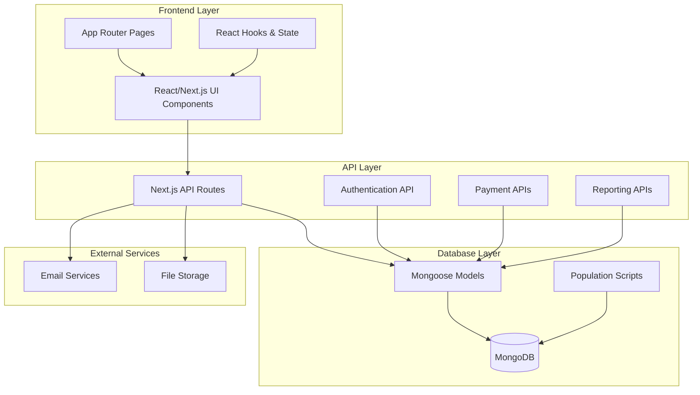
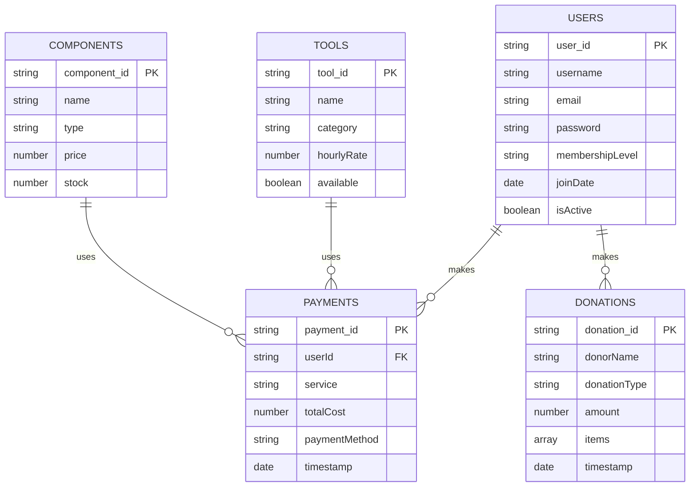
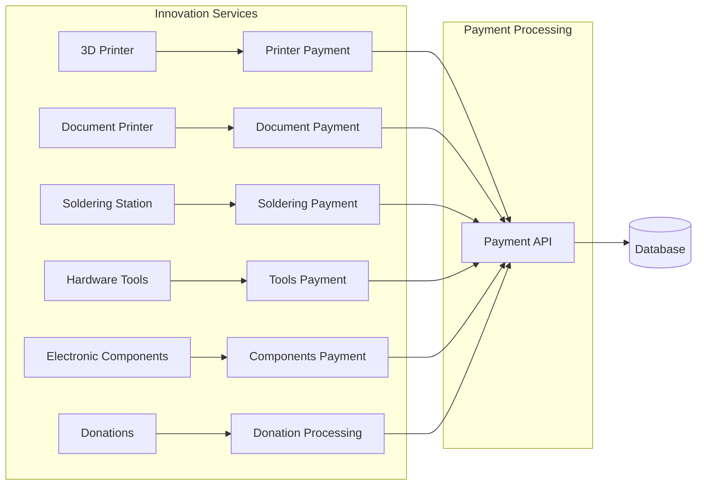
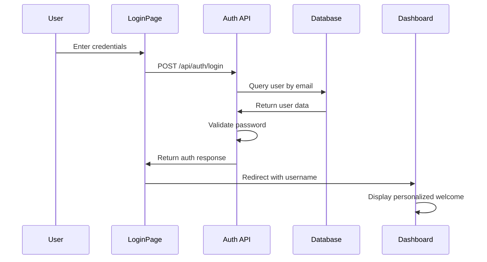
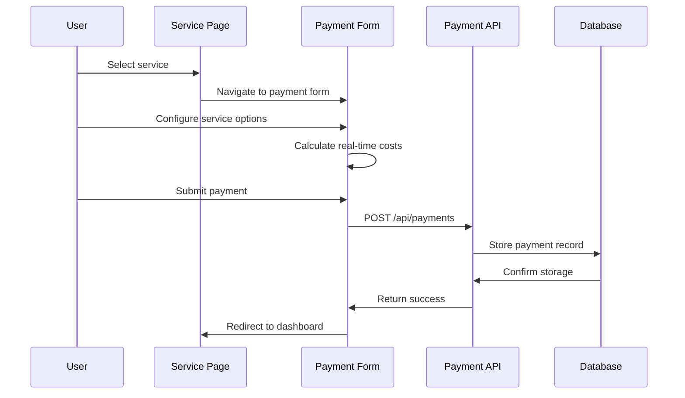
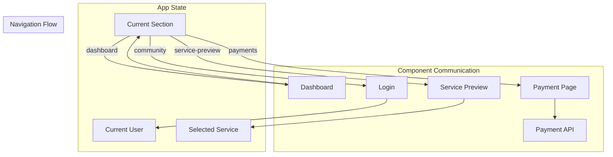
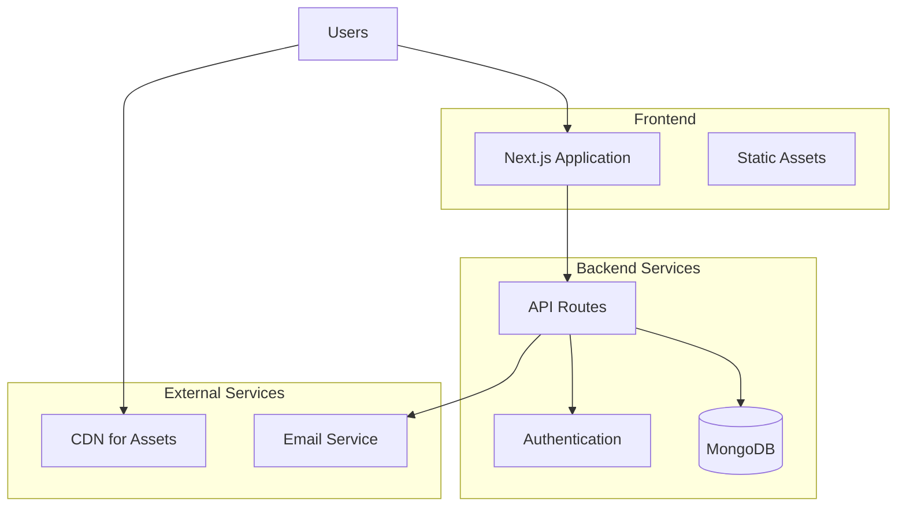

# 🏗️ Sorsogon Community Innovation Labs - Architecture Overview

## 📋 Project Summary
A comprehensive full-stack web application for managing Innovation Labs services, payments, donations, and community member interactions built with Next.js 15, MongoDB, and TypeScript.

---

## 🎯 System Architecture



---

## 🏢 Application Structure

### **Frontend Architecture (Next.js 15)**
```
src/
├── app/                    # App Router (Next.js 15)
│   ├── page.tsx           # Main application entry point
│   ├── globals.css        # Global styles
│   ├── layout.tsx         # Root layout
│   └── api/               # API routes
│       ├── auth/
│       ├── payments/
│       ├── donations/
│       └── reports/
├── components/            # React Components
│   ├── ui/               # Reusable UI components
│   ├── payment/          # Payment-specific forms
│   ├── Dashboard.tsx     # Main dashboard
│   ├── LoginPage.tsx     # Authentication
│   ├── PaymentPage.tsx   # Payment services
│   ├── ServicePreview.tsx # Service details
│   └── ...
├── lib/                  # Utilities & configurations
├── models/               # Mongoose schemas
├── types/                # TypeScript definitions
└── scripts/              # Database utilities
```

---

## 🗄️ Database Schema (MongoDB)

### **Collections Overview**


### **Data Models**
1. **Users Collection** - Community member authentication & profiles
2. **Payments Collection** - Service payment transactions
3. **Donations Collection** - Monetary & item donations
4. **Tools Collection** - Available hardware tools & equipment
5. **Components Collection** - Electronic components & parts inventory

---

## 🔧 Service Architecture

### **Core Services**


### **Service-Specific Components**

#### **1. 3D Printer Service**
- **Component**: `PrinterPaymentForm.tsx`
- **Features**: Filament calculation, time-based pricing, material selection
- **Pricing**: ₱5/hour + material costs

#### **2. Document Printer Service**
- **Component**: `DocumentPrinterPaymentForm.tsx`
- **Features**: Multi-job support, paper size options, binding services
- **Pricing**: ₱2-5/page + premium options

#### **3. Soldering Station**
- **Component**: `SolderingPaymentForm.tsx`
- **Features**: Hourly billing, safety equipment tracking
- **Pricing**: ₱10/hour

#### **4. Tools & Components**
- **Component**: `ToolsComponentsPaymentForm.tsx`
- **Features**: Inventory management, bulk discounts
- **Pricing**: Variable based on item

---

## 🔐 Authentication & Authorization

### **Authentication Flow**


### **User Management**
- **Registration**: Admin-managed (contact Innovation Labs)
- **Login**: Email/password authentication
- **Session**: Client-side state management
- **Roles**: Guest, Community Member, Administrator

---

## 💳 Payment Processing Architecture

### **Payment Flow**


### **Payment Methods**
- Cash payments
- Credit/Debit cards
- Bank transfers

---

## 📊 Data Flow Architecture

### **Application State Management**


### **Key State Variables**
- `currentSection`: Controls which page/component is displayed
- `currentUser`: Stores authenticated user information
- `selectedService`: Tracks which service user wants to use

---

## 🛠️ Technology Stack

### **Frontend**
- **Framework**: Next.js 15.5.4 (React 19)
- **Language**: TypeScript
- **Styling**: Tailwind CSS
- **UI Components**: Shadcn/ui
- **Icons**: Lucide React

### **Backend**
- **Runtime**: Node.js
- **Framework**: Next.js API Routes
- **Database**: MongoDB with Mongoose
- **Authentication**: Custom JWT-like implementation

### **Development Tools**
- **Package Manager**: npm
- **Linting**: ESLint
- **Type Checking**: TypeScript compiler
- **Database Scripts**: Custom population scripts

---

## 🚀 Deployment Architecture

### **Production Environment**


### **Environment Configuration**
- Development: Local MongoDB, Next.js dev server
- Production: Cloud MongoDB, Vercel/similar hosting

---

## 🔄 Key User Journeys

### **1. Guest User Journey**
```
Dashboard (Guest) → Service Selection → Service Preview → Payment Form → Completion
```

### **2. Community Member Journey**
```
Login → Dashboard (Personalized) → Service Selection → Payment → Member Benefits
```

### **3. Administrator Journey**
```
Login → Admin Panel → Reports → User Management → System Configuration
```

---

## 📈 Scalability Considerations

### **Performance Optimizations**
- **Component Lazy Loading**: Dynamic imports for large components
- **Database Indexing**: Optimized queries on user_id, email, timestamps
- **Caching**: Static generation for service information
- **Image Optimization**: Next.js automatic image optimization

### **Future Enhancements**
- **Real-time Updates**: WebSocket integration for live pricing
- **Mobile App**: React Native companion app
- **Advanced Analytics**: Detailed usage reports and insights
- **Integration APIs**: Third-party service integrations
- **Multi-tenancy**: Support for multiple Innovation Labs locations

---

## 🔧 Development Workflow

### **Setup & Configuration**
1. **Environment Setup**: Node.js, MongoDB connection
2. **Database Population**: `npm run populate:labs`
3. **Development Server**: `npm run dev`
4. **Type Checking**: TypeScript compilation
5. **Testing**: Component and API testing

### **Code Organization**
- **Separation of Concerns**: Clear component, API, and data layers
- **Type Safety**: Comprehensive TypeScript coverage
- **Reusable Components**: UI component library
- **Consistent Styling**: Tailwind CSS design system

---

## 📋 API Endpoints

### **Authentication**
- `POST /api/auth/login` - User authentication

### **Payments**
- `POST /api/payments` - Process service payments
- `GET /api/payments` - Retrieve payment history

### **Donations**
- `POST /api/donations` - Process donations
- `GET /api/donations` - Retrieve donation records

### **Reports**
- `GET /api/reports` - Generate system reports
- `GET /api/analytics` - Usage analytics

---

This architecture provides a robust, scalable foundation for the Sorsogon Community Innovation Labs platform, enabling efficient management of services, payments, and community interactions while maintaining excellent user experience and system reliability.