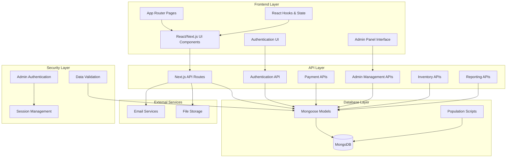
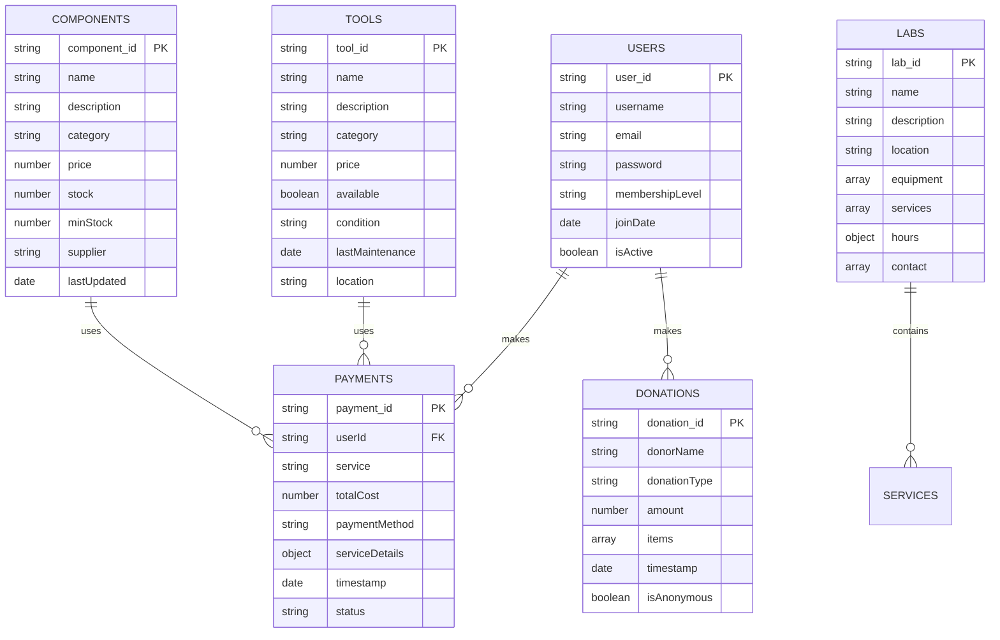
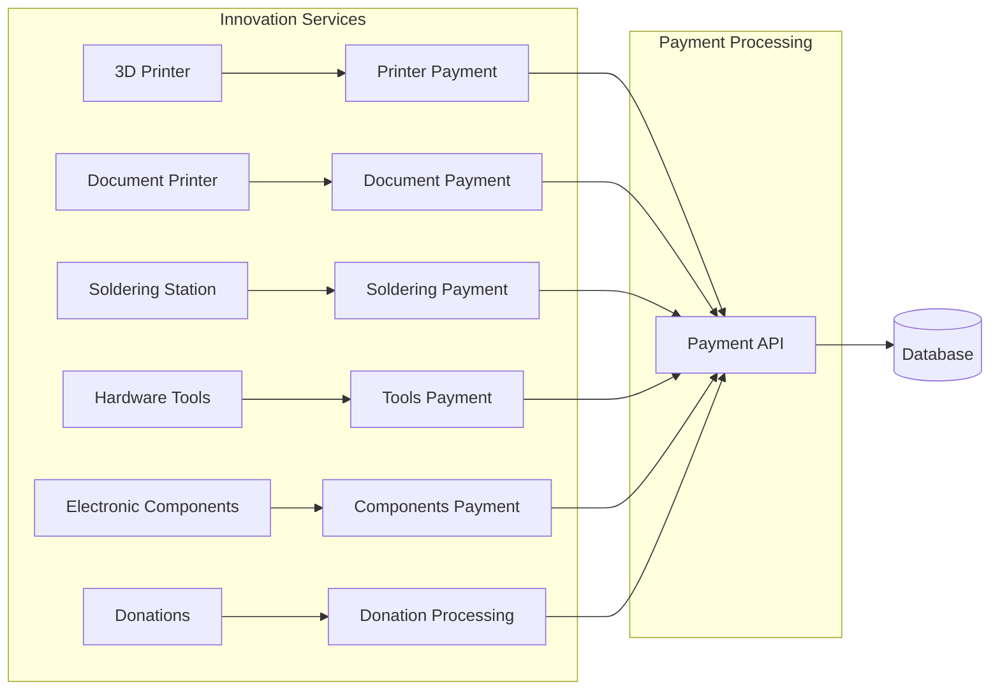
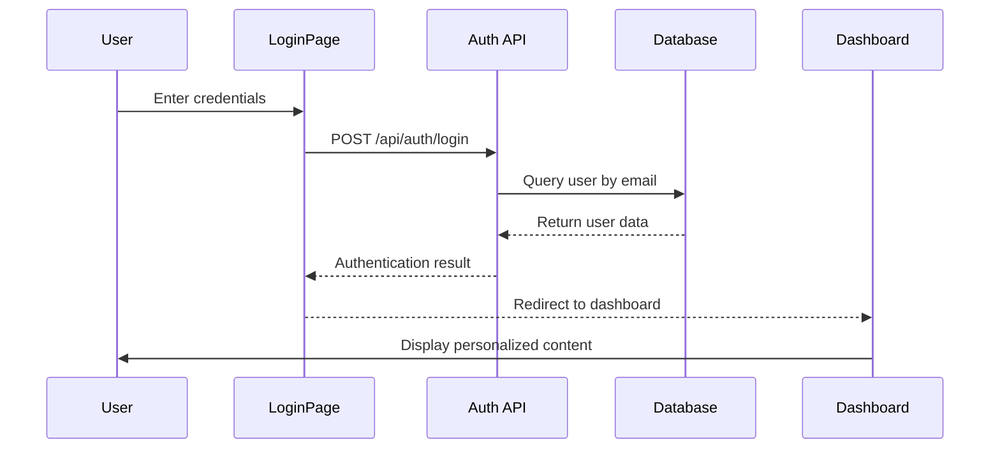
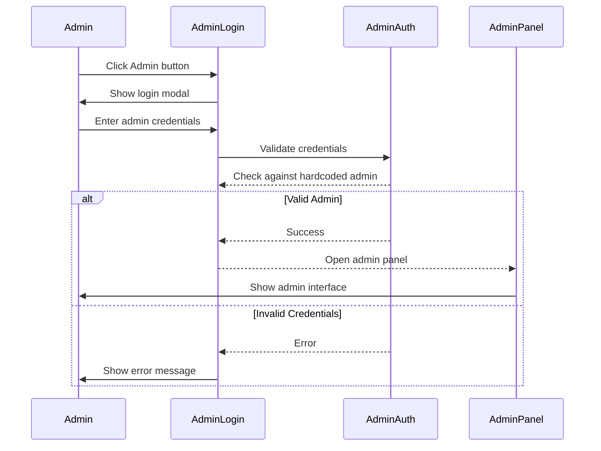
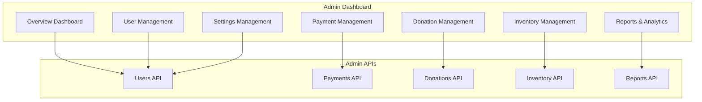
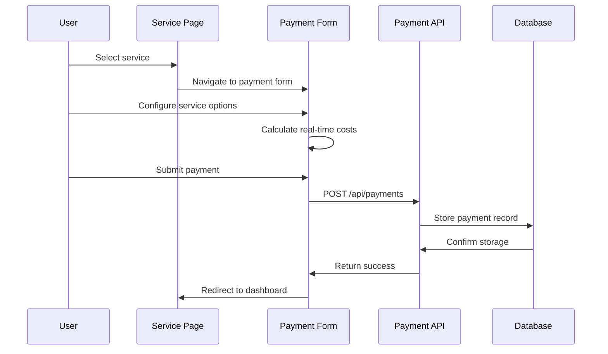
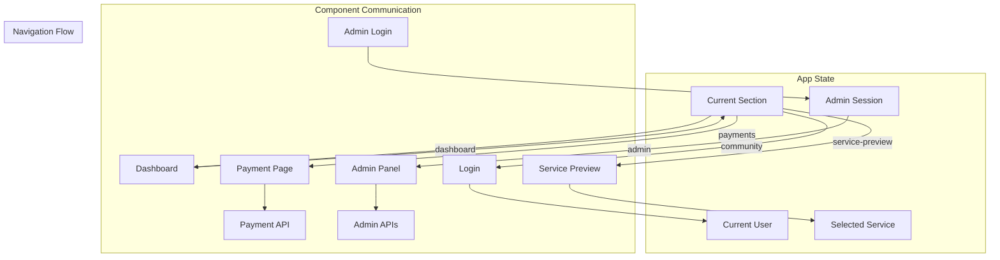
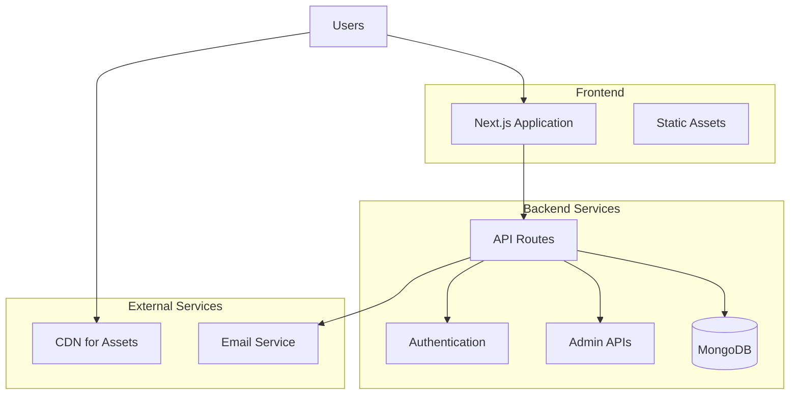

# 🏗️ Sorsogon Community Innovation Labs - Architecture Overview

## 📋 Project Summary
A comprehensive full-stack web application for managing Innovation Labs services, payments, donations, community member interactions, and administrative operations built with Next.js 15, MongoDB, and TypeScript.

---

## 🎯 System Architecture



---

## 🏢 Application Structure

### **Frontend Architecture (Next.js 15)**
```
src/
├── app/                    # App Router (Next.js 15)
│   ├── page.tsx           # Main application entry point
│   ├── globals.css        # Global styles
│   ├── layout.tsx         # Root layout
│   └── api/               # API routes
│       ├── auth/
│       │   └── route.ts   # User authentication
│       ├── payments/
│       │   └── route.ts   # Payment processing
│       ├── donations/
│       │   └── route.ts   # Donation handling
│       └── admin/         # Administrative APIs
│           ├── users/
│           ├── payments/
│           ├── donations/
│           ├── inventory/
│           └── reports/
├── components/            # React Components
│   ├── ui/               # Reusable UI components
│   │   ├── button.tsx
│   │   ├── card.tsx
│   │   ├── input.tsx
│   │   ├── label.tsx
│   │   └── select.tsx
│   ├── payment/          # Payment-specific forms
│   ├── Dashboard.tsx     # Main dashboard
│   ├── LoginPage.tsx     # User authentication
│   ├── AdminLogin.tsx    # Admin authentication
│   ├── AdminPanel.tsx    # Complete admin management
│   ├── PaymentPage.tsx   # Payment services
│   ├── ServicePreview.tsx # Service details
│   └── ...
├── lib/                  # Utilities & configurations
│   ├── mongodb.ts        # Database connection
│   └── adminAuth.ts      # Admin authentication
├── models/               # Mongoose schemas
│   ├── User.ts
│   ├── Payment.ts
│   ├── Donation.ts
│   ├── Tool.ts
│   └── Component.ts
├── types/                # TypeScript definitions
└── scripts/              # Database utilities
    └── populate-labs.js  # Lab data population
```

---

## 🗄️ Database Schema (MongoDB)

### **Collections Overview**

        string donorName
        string donationType
        number amount
```

### **Data Models**
1. **Users Collection** - Community member authentication & profiles
2. **Payments Collection** - Service payment transactions  
3. **Donations Collection** - Monetary & item donations
4. **Tools Collection** - Available hardware tools & equipment
5. **Components Collection** - Electronic components & parts inventory
6. **Labs Collection** - Innovation lab locations & information

---

## 🔧 API Architecture

### **Core API Endpoints**

#### **Public APIs**
- `POST /api/auth` - User authentication & login
- `GET /api/labs` - Lab information & services
- `POST /api/payments` - Process service payments
- `POST /api/donations` - Handle donations

#### **Admin APIs (Requires Authentication)**
- `GET/POST/PUT/DELETE /api/admin/users` - User management
- `GET/POST/PUT/DELETE /api/admin/payments` - Payment analytics & management
- `GET/POST/PUT/DELETE /api/admin/donations` - Donation tracking & management
- `GET/POST/PUT/DELETE /api/admin/inventory` - Tools & components inventory
- `GET /api/admin/reports` - System reports & analytics

#### **Authentication System**
- **User Authentication**: Username/email and password
- **Admin Authentication**: Restricted to `admin_sorsogon` with `admin@sorsogonlabs.gov.ph`
- **Session Management**: Browser-based session storage
- **Access Control**: Role-based permissions for admin functions

---

## �️ Service Architecture

### **Core Services**


### **Service-Specific Components**

#### **1. 3D Printer Service**
- **Component**: `PrinterPaymentForm.tsx`
- **Features**: Filament calculation, time-based pricing, material selection
- **Pricing**: ₱5/hour + material costs

#### **2. Document Printer Service**
- **Component**: `DocumentPrinterPaymentForm.tsx`
- **Features**: Multi-job support, paper size options, binding services
- **Pricing**: ₱2-5/page + premium options

#### **3. Soldering Station**
- **Component**: `SolderingPaymentForm.tsx`
- **Features**: Hourly billing, safety equipment tracking
- **Pricing**: ₱10/hour

#### **4. Tools & Components**
- **Component**: `ToolsComponentsPaymentForm.tsx`
- **Features**: Inventory management, bulk discounts
- **Pricing**: Variable based on item

---

## 🔐 Authentication & Authorization

### **User Authentication Flow**


### **Admin Authentication Flow**


### **Authorization Levels**
1. **Public Access**: Lab information, service previews
2. **User Access**: Service payments, donation submissions
3. **Admin Access**: Complete system management (restricted to `admin_sorsogon`)

---
    DB->>A: Return user data
    A->>A: Validate password
    A->>L: Return auth response
    L->>D: Redirect with username
    D->>D: Display personalized welcome
```

### **User Management**
- **Registration**: Admin-managed (contact Innovation Labs)
- **Login**: Email/password authentication
- **Session**: Client-side state management
- **Roles**: Guest, Community Member, Administrator

---

## � Admin Panel Architecture

### **Admin Panel Features**


### **Admin Panel Sections**

#### **1. Overview Dashboard**
- System statistics & KPIs
- Recent transactions overview
- Active users metrics
- Revenue analytics

#### **2. User Management**
- User CRUD operations
- Membership level management
- Account status control
- User activity tracking

#### **3. Payment Management**
- Transaction history
- Payment method analytics
- Revenue reports
- Refund processing

#### **4. Donation Management**
- Monetary donation tracking
- Item donation inventory
- Donor recognition system
- Impact reporting

#### **5. Inventory Management**
- Tools & equipment tracking
- Component stock management
- Maintenance scheduling
- Low stock alerts

#### **6. Reports & Analytics**
- Financial reports
- Usage analytics
- User engagement metrics
- Donation impact reports

#### **7. Settings Management**
- Service pricing configuration
- System parameters
- Email templates
- Backup management

---

## �💳 Payment Processing Architecture

### **Payment Flow**


### **Payment Methods**
- Cash payments
- Credit/Debit cards
- Bank transfers

---

## 📊 Data Flow Architecture

### **Application State Management**


### **Key State Variables**
- `currentSection`: Controls which page/component is displayed
- `currentUser`: Stores authenticated user information
- `selectedService`: Tracks which service user wants to use
- `adminSession`: Manages admin authentication state

---

## 🛠️ Technology Stack

### **Frontend**
- **Framework**: Next.js 15.5.4 (React 19)
- **Language**: TypeScript
- **Styling**: Tailwind CSS
- **UI Components**: Custom component library with shadcn/ui
- **Icons**: Lucide React
- **State Management**: React Hooks (useState, useEffect)

### **Backend**
- **Runtime**: Node.js 22+
- **Framework**: Next.js API Routes
- **Database**: MongoDB 7.0+
- **ODM**: Mongoose 8.x
- **Authentication**: Custom session-based auth

### **Development Tools**
- **Package Manager**: npm
- **Linting**: ESLint
- **Code Formatting**: Prettier (implied)
- **Build Tool**: Next.js Turbopack

## 🚀 System Features & Capabilities

### **Core Features**

#### **Public Features**
- 🏢 **Lab Information Display**: Interactive lab locations and services
- 👥 **Community Access**: Guest browsing of available services
- 📱 **Responsive Design**: Mobile-first responsive interface
- 🔍 **Service Discovery**: Browse and preview all innovation services

#### **User Features**
- 🔐 **User Authentication**: Secure login and registration
- 💳 **Payment Processing**: Comprehensive service payment forms
- 📊 **Personal Dashboard**: Personalized user experience with name formatting
- 🎯 **Service Selection**: Choose from 5 core innovation services
- 💰 **Donation System**: Support the labs through monetary/item donations

#### **Admin Features (admin_sorsogon only)**
- 🛡️ **Secure Admin Access**: Restricted authentication for administrators
- 📊 **System Overview**: Real-time statistics and metrics dashboard
- 👤 **User Management**: CRUD operations for community members
- 💸 **Payment Analytics**: Transaction tracking and financial reports
- ❤️ **Donation Management**: Track monetary and item donations
- 📦 **Inventory Control**: Tools and components stock management
- 📈 **Advanced Reports**: 6 types of comprehensive analytics reports
- ⚙️ **System Settings**: Configuration and pricing management

### **Innovation Services**

#### **1. 3D Printing Service**
- **Features**: Multi-material support, quality selection, rush options
- **Pricing**: ₱10-50/gram based on material and quality
- **Payment Form**: `3DPrinterPaymentForm.tsx`

#### **2. Document Printing**
- **Features**: Multiple paper sizes, binding options, bulk pricing
- **Pricing**: ₱2-5/page + premium options
- **Payment Form**: `DocumentPrinterPaymentForm.tsx`

#### **3. Soldering Station**
- **Features**: Hourly rental, safety equipment included
- **Pricing**: ₱10/hour
- **Payment Form**: `SolderingPaymentForm.tsx`

#### **4. Hardware Tools**
- **Features**: Inventory tracking, hourly rates, condition monitoring
- **Pricing**: Variable by tool
- **Payment Form**: `ToolsComponentsPaymentForm.tsx`

#### **5. Electronic Components**
- **Features**: Stock management, bulk discounts, supplier tracking
- **Pricing**: Variable by component
- **Payment Form**: `ToolsComponentsPaymentForm.tsx`

---

## 🚀 Deployment Architecture

### **Production Environment**


### **Environment Configuration**
- **Development**: Local MongoDB, Next.js dev server
- **Production**: Cloud MongoDB, Vercel/similar hosting
- **Database**: MongoDB Atlas or self-hosted MongoDB

---

## 🔄 Key User Journeys

### **1. Guest User Journey**
```
Dashboard (Guest) → Service Selection → Service Preview → Payment Form → Completion
```

### **2. Community Member Journey**
```
Login → Dashboard (Personalized) → Service Selection → Payment → Member Benefits
```

### **3. Administrator Journey**
```
Admin Login → Admin Panel → Reports → User Management → Inventory Control → System Configuration
```

---

## 📈 Scalability Considerations

### **Performance Optimizations**
- **Component Lazy Loading**: Dynamic imports for large components
- **Database Indexing**: Optimized queries on user_id, email, timestamps
- **Caching**: Static generation for service information
- **Error Handling**: Comprehensive error boundaries and graceful degradation
- **Data Validation**: Client and server-side validation for all inputs

### **Security Measures**
- **Admin Access Control**: Hardcoded admin credentials for maximum security
- **Input Sanitization**: All user inputs validated and sanitized
- **Session Management**: Secure browser-based session storage
- **API Rate Limiting**: Protection against abuse (recommended for production)
- **Data Encryption**: Sensitive data protection in transit and at rest

### **Future Enhancements**
- **Real-time Notifications**: WebSocket integration for live updates
- **Advanced Analytics**: Machine learning insights for usage patterns
- **Mobile Application**: React Native companion app
- **Payment Gateway Integration**: Stripe/PayPal for online payments
- **Multi-tenancy**: Support for multiple innovation lab locations
- **Advanced Reporting**: Export capabilities (PDF, Excel)
- **Inventory Automation**: IoT integration for real-time stock tracking

---

## 📚 Development Guidelines

### **Code Organization**
- **Component Structure**: Modular, reusable components with TypeScript
- **API Design**: RESTful endpoints with consistent error handling
- **Database Design**: Normalized collections with appropriate indexing
- **Testing Strategy**: Unit tests for critical functions (recommended)

### **Development Workflow**
1. **Setup**: Clone repository, install dependencies
2. **Database**: Run population scripts for test data
3. **Development**: Use Next.js dev server with hot reload
4. **Testing**: Manual testing across all user journeys
5. **Deployment**: Build and deploy to production environment

### **Key Commands**
```bash
npm install                 # Install dependencies
npm run dev                # Start development server
npm run build              # Build for production
npm run populate:labs      # Populate database with lab data
npm run lint               # Run ESLint
```

---

## 🎯 Project Status & Roadmap

### **Current Status (v1.0)**
✅ **Core Functionality**: All basic features implemented and tested
✅ **User Authentication**: Secure login system with personalized experience
✅ **Payment Processing**: Complete payment forms for all 5 services
✅ **Admin Panel**: Comprehensive administrative interface
✅ **Database Integration**: Full CRUD operations across all collections
✅ **Error Handling**: Robust error management and user feedback
✅ **Responsive Design**: Mobile-first interface across all components

### **Upcoming Features (v1.1)**
🔄 **Real-time Updates**: Live data refresh in admin panel
🔄 **Enhanced Analytics**: Advanced reporting and data visualization
🔄 **Backup System**: Automated database backup solutions
🔄 **Email Integration**: Notification system for transactions
🔄 **API Documentation**: Comprehensive API documentation

### **Long-term Vision (v2.0)**
🎯 **Multi-location Support**: Expand to multiple innovation labs
🎯 **Mobile Application**: Native mobile app development
🎯 **Payment Gateway**: Online payment processing
🎯 **IoT Integration**: Smart inventory management
🎯 **Community Features**: User forums and collaboration tools

---

## 📞 Contact & Support

### **Development Team**
- **Project**: Sorsogon Community Innovation Labs Management System
- **Technology Stack**: Next.js 15, MongoDB, TypeScript
- **Admin Access**: `admin_sorsogon` / `admin@sorsogonlabs.gov.ph`

### **System Requirements**
- **Node.js**: v18.0.0 or higher
- **MongoDB**: v5.0 or higher
- **Browser**: Modern browsers with JavaScript enabled
- **Network**: Internet connection for external services

---

*This architecture document reflects the current state of the Sorsogon Community Innovation Labs management system as of October 2025. The system provides comprehensive management capabilities for innovation lab operations, user management, and administrative oversight.*
- **Real-time Updates**: WebSocket integration for live pricing
- **Mobile App**: React Native companion app
- **Advanced Analytics**: Detailed usage reports and insights
- **Integration APIs**: Third-party service integrations
- **Multi-tenancy**: Support for multiple Innovation Labs locations

---

## 🔧 Development Workflow

### **Setup & Configuration**
1. **Environment Setup**: Node.js, MongoDB connection
2. **Database Population**: `npm run populate:labs`
3. **Development Server**: `npm run dev`
4. **Type Checking**: TypeScript compilation
5. **Testing**: Component and API testing

### **Code Organization**
- **Separation of Concerns**: Clear component, API, and data layers
- **Type Safety**: Comprehensive TypeScript coverage
- **Reusable Components**: UI component library
- **Consistent Styling**: Tailwind CSS design system

---

## 📋 API Endpoints

### **Authentication**
- `POST /api/auth/login` - User authentication

### **Payments**
- `POST /api/payments` - Process service payments
- `GET /api/payments` - Retrieve payment history

### **Donations**
- `POST /api/donations` - Process donations
- `GET /api/donations` - Retrieve donation records

### **Reports**
- `GET /api/reports` - Generate system reports
- `GET /api/analytics` - Usage analytics

---

This architecture provides a robust, scalable foundation for the Sorsogon Community Innovation Labs platform, enabling efficient management of services, payments, and community interactions while maintaining excellent user experience and system reliability.